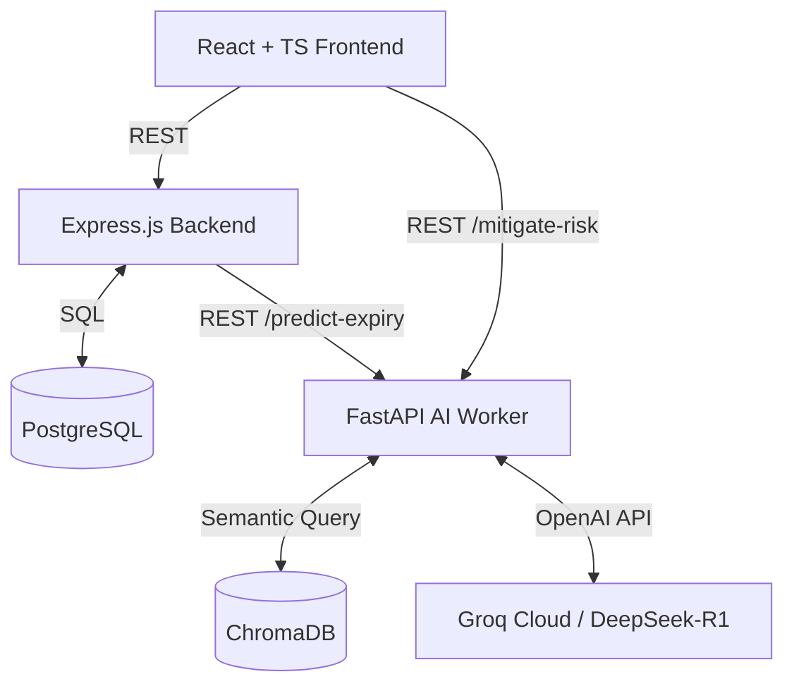

# Smart Warehouse Inventory & Expiry Optimizer

A production-grade monorepo for small-to-medium retail pharmacies and grocery stores to track stock, predict product expiration risk via sales velocity, and generate mitigation actions using a local RAG pipeline with Groq-hosted LLMs.

## 🏗️ Architecture



## 🚀 Quick Start

1. **Clone the repository**
2. **Set your Groq API Key**: 
   Export it in your shell before running Docker Compose:
   ```bash
   export LLM_API_KEY="your_groq_api_key_here"
   ```
3. **Start the stack**:
   ```bash
   docker-compose up -d --build
   ```
4. **Access Services**:
   - Frontend Dashboard: `http://localhost:80`
   - Backend API: `http://localhost:5000`
   - AI Worker: `http://localhost:8000`

## 📦 Services

### 1. Database (PostgreSQL)
- Runs on port `5432`
- Stores `products`, `inventory_batches`, and `sales_log`.
- Automatically initialized via `init.sql` on startup.

### 2. Backend Orchestrator (Node.js/Express)
- Runs on port `5000`
- Provides API endpoints:
  - `POST /api/inventory/batch`: Intake inventory batches
  - `POST /api/sales`: Log sales (FIFO stock deduction)
  - `GET /api/analytics/expiry-risk`: Aggregates active batches and proxies to AI worker

### 3. AI Worker (Python/FastAPI)
- Runs on port `8000`
- Provides two core pipelines:
  - `POST /predict-expiry`: Deterministic velocity math to flag High/Medium/Low expiry risk.
  - `POST /mitigate-risk`: Semantic query on store policy markdown via ChromaDB, followed by a Groq-hosted LLM request (DeepSeek-R1) to draft discount bundles or vendor return emails.

### 4. Vector Database (ChromaDB)
- Runs on port `8200`
- Automatically initialized by the AI Worker on startup to embed and store `store_policies.md`.

### 5. Frontend Dashboard (React/TypeScript/Vite)
- Available at `http://localhost:80`
- Provides a three-tab interface:
  - **Intake Forms**: Log new inventory and sales events.
  - **Analytics**: Visualize stock levels and risk decay trends using Recharts.
  - **Mitigation Center**: Generate and copy AI mitigation strategies for high-risk batches.

## 📝 Development

For local development without Docker:
1. Start PostgreSQL and ChromaDB containers.
2. `cd backend && npm install && npm run dev`
3. `cd ai-worker && pip install -r requirements.txt && uvicorn app.main:app --reload`
4. `cd frontend && npm install && npm run dev` (Access at `http://localhost:5173`)
